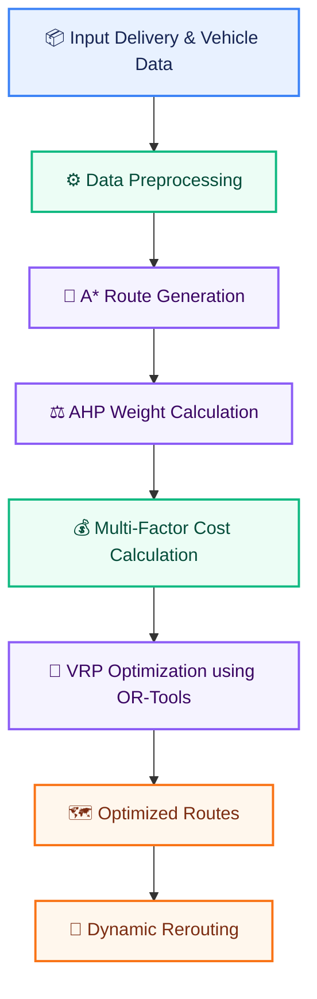

# PathWise

Multi-Factor Delivery Route Optimization System.

## Project Flow

```mermaid
flowchart TD
    A["📦 Input Delivery & Vehicle Data"] 
    --> B["⚙️ Data Preprocessing"]

    B --> C["🧭 A* Route Generation"]

    C --> D["⚖️ AHP Weight Calculation"]

    D --> E["💰 Multi-Factor Cost Calculation"]

    E --> F["🚚 VRP Optimization using OR-Tools"]

    F --> G["🗺️ Optimized Routes"]

    G --> H["🔄 Dynamic Rerouting"]

    A:::input
    B:::process
    C:::algorithm
    D:::algorithm
    E:::process
    F:::algorithm
    G:::result
    H:::result

    classDef input fill:#e8f1ff,stroke:#3b82f6,stroke-width:2px,color:#172554
    classDef process fill:#ecfdf5,stroke:#10b981,stroke-width:2px,color:#064e3b
    classDef algorithm fill:#f5f3ff,stroke:#8b5cf6,stroke-width:2px,color:#3b0764
    classDef result fill:#fff7ed,stroke:#f97316,stroke-width:2px,color:#7c2d12
```
